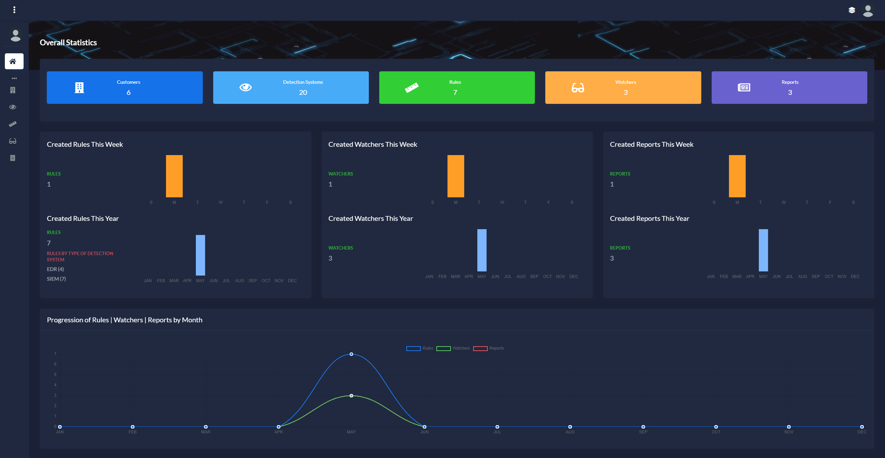
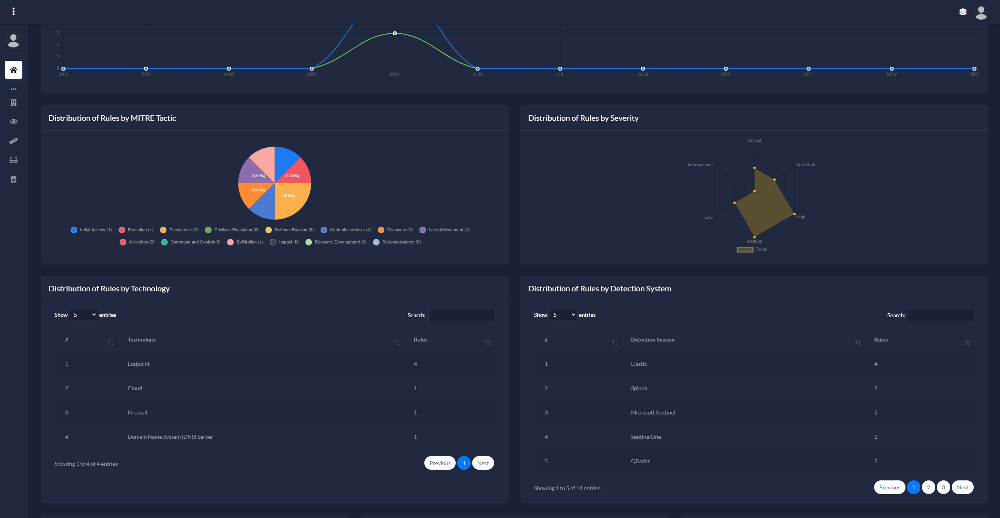
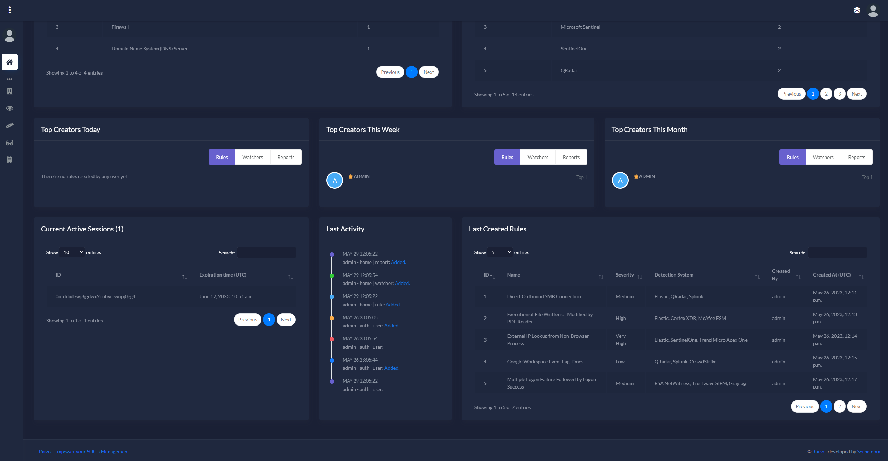
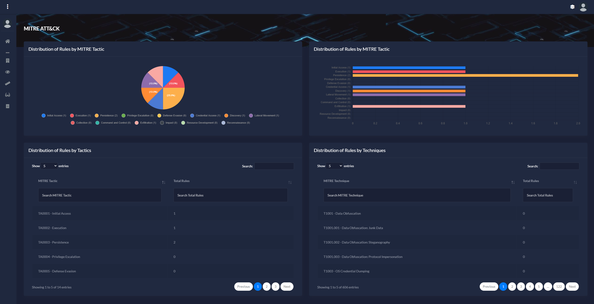
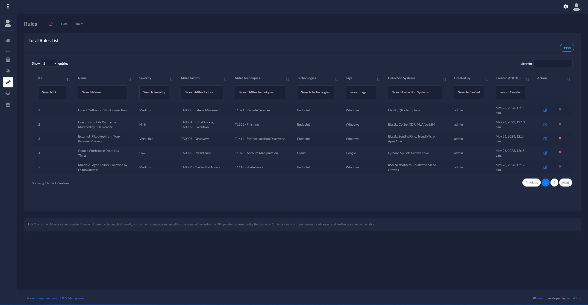

# Raizo - Empower your SOC's Management

**Raizo** is a comprehensive inventory management system specifically designed for external or internal SOCs (Security Operations Centers). Its main objective is to facilitate cybersecurity management for one or multiple clients with multiple detection systems in their environments. These detection systems typically include assets such as "detection rules," "watchers," or "reports."

Raizo arises from the need for a specialized tool that enables the unified management of assets' inventory developed in each platform or client, while maintaining precise control over who, how, when, and where an asset affects the detection system. It provides SOC technicians and managers with the ability to build a robust and unified inventory using a relational database. This eliminates the dependence on generic tools like Excel, which, although powerful, do not meet more advanced needs such as information insertion control or long-term scalability.

Furthermore, Raizo is fully integrated with the [MITRE ATT&CK framework](https://attack.mitre.org/). This integration allows for a comprehensive view of the cybersecurity protection status of your SOC.

Take a look at some screenshots of Raizo's interface below:

Main Dashboard:
<kbd>
  
</kbd>

Main Dashboard (2):
<kbd>
  
</kbd>

Main Dashboard (3):
<kbd>
  
</kbd>

MITRE Dashboard:
<kbd>
  
</kbd>

Rules Table:
<kbd>
  
</kbd>

These screenshots showcase the user-friendly interface and powerful features of Raizo, demonstrating its effectiveness in managing cybersecurity assets.

**And, for those people who fear the dark, Raizo has a light mode available to users who configure it in their profile preferences.**
<br />

> 🚀 Built with [Django](https://www.djangoproject.com/)

- `Up-to-date dependencies`
- Database: `sqlite or PostgreSQL/MySQL (recomended for big enviroments with a lot of users which need concurrency)`
- UI-Ready app, Django Native ORM
- `Session-Based authentication`
- Frontend based in [Atlantis Lite](https://themekita.com/demo-atlantis-lite-bootstrap/) 

<br />

<br /> 

## ✨ Install the App

> **Step 1** - Download the code from the GH repository (using `GIT`) 

```bash
$ git clone https://github.com/serpaldom/Raizo
$ cd Raizo
```

<br />

> **Step 2** - Create the database (optional if you use PostgreSQL/MySQL)

You can change what database engine to use in the settings.py file. Remember to change the options to connect to your database properly.

PostgreSQL:

1. Install PostgreSQL server
2. Create a new role based in the username that django will use to manage the database (specify in the settings.py file)
3. Grant all permissions to that new role
4. Create a database based in the database name that django will use to manage the database (specify in the settings.py file)
5. Make the new role as owner of the new database
<br />

<br />

> **Step 3** - Install all dependencies
```bash
$  pip install -r requirements.txt    
```

<br />

> **Step 4** - Create a superuser & import initial data

Create a super user:
```bash
$  python3 manage.py createsuperuser
```
And then, import initial data
```bash
$   python3 manage.py loaddata default.json    
```
<br />

> **Step 5** - Run it!

Credentials for superuser: admin/admin

```bash
$  python manage.py runserver   
```

At this point, the app runs at `http://127.0.0.1:8000/`. 
<br />

## ✨ Sign in

By default, the app redirects guest users to authenticate. In order to access the private pages, follow this set up: 

- Access the `sign in` page and authenticate (admin/admin)
  - `http://127.0.0.1:8000/login/`

<br />

## ✨ Code-base structure

The project is coded using a simple and intuitive structure presented below:

```bash
< PROJECT ROOT >
   |
   |-- core/                               # Implements app configuration
   |    |-- settings.py                    # Defines Global Settings
   |    |-- wsgi.py                        # Start the app in production
   |    |-- urls.py                        # Define URLs served by all apps/nodes
   |
   |-- apps/
   |    |
   |    |-- home/                          # A simple app that serve HTML files
   |    |    |-- views.py                  # Serve HTML pages for authenticated users
   |    |    |-- urls.py                   # Define some super simple routes 
   |    |    |-- DatabaseManager.py        # Object to interact with the database
   |    |    |-- ExportManager.py          # Object to do some CSV exports
   |    |
   |    |-- authentication/                # Handles auth routes (login and register)
   |    |    |-- urls.py                   # Define authentication routes  
   |    |    |-- views.py                  # Handles login and registration  
   |    |    |-- forms.py                  # Define auth forms (login and register) 
   |    |
   |    |-- static/
   |    |    |-- <css, JS, images>         # CSS files, Javascripts files
   |    |
   |    |-- templates/                     # Templates used to render pages
   |         |-- includes/                 # HTML chunks and components
   |         |    |-- navigation.html      # Top menu component
   |         |    |-- sidebar.html         # Sidebar component
   |         |    |-- footer.html          # App Footer
   |         |    |-- scripts.html         # Scripts common to all pages
   |         |
   |         |-- layouts/                   # Master pages
   |         |    |-- base-fullscreen.html  # Used by Authentication pages
   |         |    |-- base.html             # Used by common pages
   |         |
   |         |-- accounts/                  # Authentication pages
   |         |    |-- login.html            # Login page
   |         |    |-- register.html         # Register page
   |         |
   |         |-- home/                      # UI Kit Pages
   |              |-- index.html            # Index page
   |              |-- 404-page.html         # 404 page
   |              |-- *.html                # All other pages
   |
   |-- requirements.txt                     # Development modules - SQLite storage
   |
   |-- .env                                 # Inject Configuration via Environment
   |-- manage.py                            # Start the app - Django default start script
   |
   |-- ************************************************************************
```

<br />

## ✨ Future features

**1**. Ability to upload CSV files in a specific format to bulk create multiple rules, customers, reports, and watchers simultaneously.

**2**. Add the capability for automatic synchronization of rule creation/deletion with detection system instances such as Elastic. 

**3**. Dynamic generation of reports in PDF format. 


<br />
